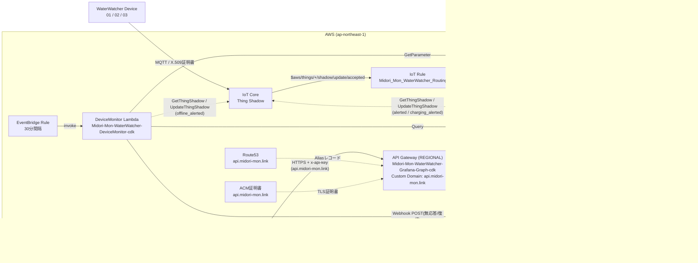

# Midori-Mon-WaterWatcher AWS構成図

```mermaid
flowchart LR
    D["WaterWatcher Device<br/>01 / 02 / 03"]

    subgraph AWS["AWS (ap-northeast-1)"]
        IOT["IoT Core<br/>Thing Shadow"]
        RULE["IoT Rule<br/>Midori_Mon_WaterWatcher_Routing_cdk"]
        NLAMBDA["Notification Lambda<br/>Midori-Mon-WaterWatcher-Notification-cdk"]
        EVB["EventBridge Rule<br/>30分間隔"]
        MLAMBDA["DeviceMonitor Lambda<br/>Midori-Mon-WaterWatcher-DeviceMonitor-cdk"]
        SSM["SSM Parameter Store<br/>Discord Webhook URL"]
        DDB[("DynamoDB<br/>MoistureSensor / DeviceBattery / TemperatureSensor")]
        ROUTE53["Route53<br/>api.midori-mon.link"]
        ACM["ACM証明書<br/>api.midori-mon.link"]
        APIGW["API Gateway (REGIONAL)<br/>Midori-Mon-WaterWatcher-Grafana-Graph-cdk<br/>Custom Domain: api.midori-mon.link"]
        GLAMBDA["Grafana-Graph Lambda<br/>Midori-Mon-WaterWatcher-Grafana-Graph-cdk"]
    end

    DISCORD["Discord"]
    GRAFANA["Grafana (Amazon Lightsail)<br/>CDK管理外"]

    D -- "MQTT / X.509証明書" --> IOT
    IOT -- "$aws/things/+/shadow/update/accepted" --> RULE
    RULE -- invoke --> NLAMBDA
    NLAMBDA -- PutItem --> DDB
    NLAMBDA -- GetParameter --> SSM
    NLAMBDA -- "Webhook POST(水分/給電停止・再開)" --> DISCORD
    NLAMBDA -. "GetThingShadow / UpdateThingShadow<br/>(alerted / charging_alerted)" .-> IOT

    EVB -- invoke --> MLAMBDA
    MLAMBDA -- Query --> DDB
    MLAMBDA -- GetParameter --> SSM
    MLAMBDA -- "Webhook POST(無応答/復帰)" --> DISCORD
    MLAMBDA -. "GetThingShadow / UpdateThingShadow<br/>(offline_alerted)" .-> IOT

    GRAFANA -- "HTTPS + x-api-key<br/>(api.midori-mon.link)" --> APIGW
    ROUTE53 -. "Aliasレコード" .-> APIGW
    ACM -. "TLS証明書" .-> APIGW
    APIGW -- invoke --> GLAMBDA
    GLAMBDA -- Query --> DDB
```
